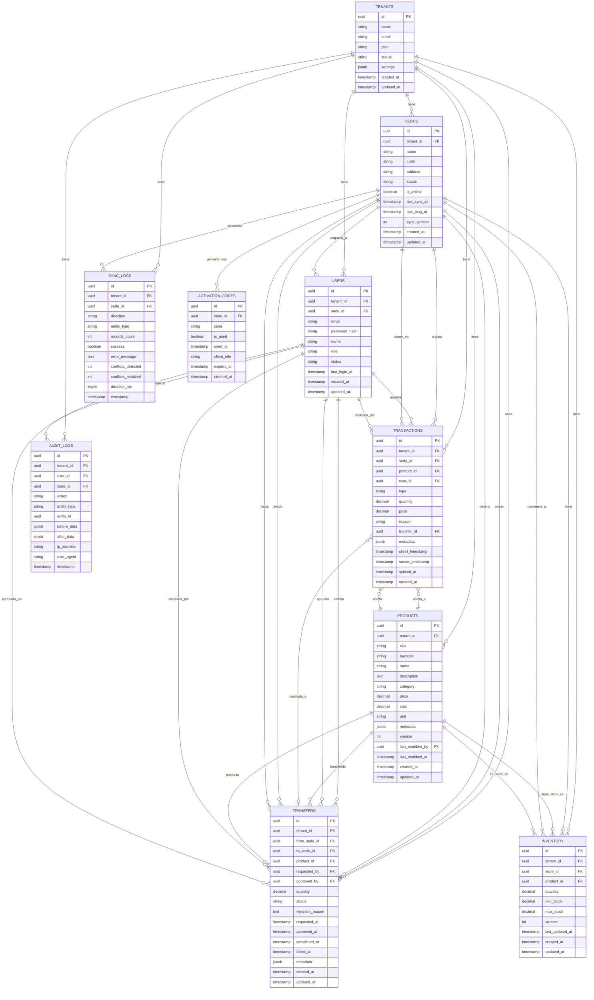

# Diagrama Entidad-Relación (ERD)
## Base de Datos PostgreSQL - Backend Hub

**Proyecto:** Stocky  
**Versión:** 2.0 (Arquitectura Híbrida)  
**Última actualización:** 2026-02-09

---

## Introducción

Este documento describe el esquema completo de la base de datos relacional PostgreSQL que actúa como **hub centralizado y fuente de verdad global** del sistema Stocky.

### Cambios respecto a la versión 1.0:

- **La nube es ahora la fuente de verdad autoritativa** (no solo vistas consolidadas)
- Cada sede usa **SQLite** en aplicaciones de escritorio (Tauri/Electron), no IndexedDB
- Sincronización bidireccional robusta con detección y resolución de conflictos
- Soporte para múltiples cajas por sede con sincronización LAN
- Campos adicionales para versionado: `version`, `last_modified_by`, `last_modified_at`
- Timestamps duales: `client_timestamp` vs `server_timestamp`
- Nuevas tablas: `activation_codes`, `sync_logs`

Esta base de datos almacena:

- **Estado maestro global** de todos los tenants (productos, inventario, transacciones)
- **Coordinación** de transferencias entre sedes
- **Auditoría** completa de operaciones
- **Configuración** multi-tenant
- **Sincronización** bidireccional con sedes (push/pull)

**Importante:** Cada sede tiene su propia base de datos SQLite local que se sincroniza con este backend. La nube es la fuente de verdad para resolución de conflictos y reportes consolidados.

---

## Diagrama Completo de Relaciones



---

## Entidades Principales

### 1. TENANTS
Representa cada organización/empresa que usa el sistema (multi-tenancy).

**Campos clave:**
- `plan`: FREE | BASIC | PREMIUM | ENTERPRISE - Determina límites de sedes, usuarios, productos
- `settings`: JSON flexible para configuraciones (logo, colores, políticas de stock, timezone, currency)
- `status`: ACTIVE | SUSPENDED | CANCELLED

**Relaciones:** Un tenant tiene múltiples sedes, usuarios, productos, etc.

---

### 2. SEDES
Sucursales o puntos de venta. Cada sede tiene su propia aplicación de escritorio con SQLite local.

**Campos clave:**
- `code`: Código corto único (ej: "TN-001")
- `is_online`: Booleano actualizado por heartbeat cada 30s
- `last_ping_at`: Último heartbeat recibido. Si > 2 min, se considera offline
- `last_sync_at`: Última sincronización exitosa
- `sync_version`: Número incremental para detectar cambios pendientes

**Relaciones:** Pertenece a un tenant, tiene usuarios, inventario, transacciones, se activa con códigos

---

### 3. ACTIVATION_CODES (Nueva)
Códigos de activación de un solo uso para activar aplicaciones de escritorio.

**Campos clave:**
- `code`: Código alfanumérico de 6 caracteres
- `is_used`: Una vez usado, no se puede reutilizar
- `expires_at`: Previene uso de códigos antiguos (ej: 7 días)
- `client_info`: JSON con información del dispositivo activado

**Flujo:**
1. Admin crea sede → Backend genera código
2. Admin descarga instalador + código
3. Al instalar, ingresa código
4. App valida código, descarga catálogo inicial a SQLite

---

### 4. USERS
Usuarios con roles y permisos (RBAC).

**Campos clave:**
- `sede_id`: Nullable para TENANT_ADMIN que puede ver todas las sedes
- `role`: SUPER_ADMIN | TENANT_ADMIN | MANAGER | STAFF
- `status`: ACTIVE | INACTIVE | LOCKED

**Autenticación:** Login genera JWT con `{ userId, tenantId, sedeId, role, exp }`

---

### 5. PRODUCTS
Catálogo maestro de productos. La nube es la fuente de verdad.

**Campos clave:**
- `sku`: Código único del producto (único por tenant)
- `barcode`: Puede ser null. Múltiples productos pueden tener el mismo barcode
- `version`: Número incremental para Last-Write-Wins
- `last_modified_by` + `last_modified_at`: Para resolución de conflictos y auditoría
- `metadata`: JSON flexible (supplier, weight, dimensions, is_perishable, etc.)

**Reglas de sincronización:**
- Creación: Puede crearse offline, se sincroniza después
- Actualización: Last-Write-Wins basado en `version` y `last_modified_at` del servidor
- Eliminación: Soft delete para preservar historial

---

### 6. INVENTORY
Stock actual de cada producto en cada sede. La nube es autoritativa.

**Campos clave:**
- `quantity`: No puede ser negativo (constraint). Stock actual
- `version`: Incrementa en cada actualización
- Unique constraint: `(product_id, sede_id)`

**Cálculo de quantity:**
```sql
SELECT SUM(quantity) 
FROM transactions 
WHERE product_id = :productId AND sede_id = :sedeId;
```

**Sincronización:** Si hay conflicto, se recalcula desde transacciones en ambos lados

---

### 7. TRANSACTIONS
Registro inmutable de todas las operaciones. Modelo append-only.

**Campos clave:**
- `id`: UUID generado en el cliente. Garantiza unicidad incluso offline
- `type`: SALE | PURCHASE | ADJUSTMENT | TRANSFER_IN | TRANSFER_OUT
- `client_timestamp` vs `server_timestamp`: El del servidor es autoritativo
- `synced_at`: NULL si aún no se sincronizó

**Reglas:**
- Append-only: Nunca UPDATE ni DELETE
- Idempotencia: `INSERT ... ON CONFLICT (id) DO NOTHING`
- No hay conflictos porque nunca se modifican

---

### 8. TRANSFERS
Transferencias entre sedes. Operación coordinada por el backend.

**Campos clave:**
- `status`: PENDING → APPROVED → PROCESSING → COMPLETED (o REJECTED/FAILED)
- `approved_by`: Usuario que aprobó (Manager de sede origen)
- `failed_at`: Timestamp si falló la ejecución

**Flujo:**
1. Solicitud (PENDING) → Valida sedes online
2. Aprobación (APPROVED) → Manager valida stock
3. Procesamiento (PROCESSING) → Job en BullMQ, transacción ACID
4. Completado (COMPLETED) → Notifica vía WebSocket

**Constraint:** `CHECK (from_sede_id != to_sede_id)`

---

### 9. AUDIT_LOGS
Registro inmutable de todas las acciones importantes.

**Campos clave:**
- `action`: CREATE | UPDATE | DELETE | TRANSFER | SYNC | LOGIN | LOGOUT
- `entity_type` + `entity_id`: Qué fue afectado
- `before_data` + `after_data`: Cambios realizados (para UPDATE)
- `ip_address` + `user_agent`: Para seguridad

**Usos:** Auditoría, resolución de conflictos, detección de fraudes, debugging

---

### 10. SYNC_LOGS (Nueva)
Registro de operaciones de sincronización. Diagnóstico y monitoreo.

**Campos clave:**
- `direction`: PUSH (sede→nube) | PULL (nube→sede)
- `conflicts_detected` / `conflicts_resolved`: Métricas de conflictos
- `duration_ms`: Para detectar sincronizaciones lentas

**Uso:** Detectar sedes con problemas de sincronización, monitorear performance

---

## Decisiones de Diseño Clave

### 1. Multi-Tenancy
- Todas las tablas tienen `tenant_id`
- PostgreSQL Row-Level Security (RLS) garantiza aislamiento
- Prisma middleware inyecta `tenant_id` automáticamente
- NestJS guards validan `user.tenantId === resource.tenantId`

### 2. Consistencia Híbrida
**Eventual para operaciones locales:**
- Ventas, entradas, ajustes se ejecutan localmente
- Se sincronizan después cuando hay conexión
- Last-Write-Wins para conflictos basado en timestamp del servidor

**Fuerte para transferencias inter-sede:**
- Requiere ambas sedes online
- Validación en tiempo real
- Ejecución atómica con transacciones ACID

### 3. Append-Only para Transacciones
**Ventajas:**
- Evita conflictos de sincronización
- Auditoría completa e inmutable
- Cálculo de stock siempre consistente
- Permite reconstruir estado en cualquier momento

**Implementación:**
- Nunca UPDATE ni DELETE en TRANSACTIONS
- Solo INSERT
- Stock actual = SUM(quantity) WHERE product_id = X

### 4. La Nube como Fuente de Verdad
**Cambio respecto a v1:**
- v1: Backend almacenaba solo "vistas consolidadas"
- v2: Backend es la fuente de verdad autoritativa

**Ventajas:**
- Resolución de conflictos clara (Last-Write-Wins con timestamp del servidor)
- Auditabilidad completa
- Reportes confiables
- Backup centralizado

---

## Índices Recomendados

```sql
-- Multi-tenancy (todas las queries filtran por tenant)
CREATE INDEX idx_sedes_tenant ON sedes(tenant_id);
CREATE INDEX idx_users_tenant ON users(tenant_id);
CREATE INDEX idx_products_tenant ON products(tenant_id);
CREATE INDEX idx_inventory_tenant_sede ON inventory(tenant_id, sede_id);
CREATE INDEX idx_transactions_tenant_sede ON transactions(tenant_id, sede_id);
CREATE INDEX idx_transfers_tenant ON transfers(tenant_id);
CREATE INDEX idx_audit_tenant ON audit_logs(tenant_id);

-- Búsquedas frecuentes
CREATE INDEX idx_products_sku ON products(tenant_id, sku);
CREATE INDEX idx_products_barcode ON products(barcode) WHERE barcode IS NOT NULL;
CREATE INDEX idx_users_email ON users(tenant_id, email);
CREATE INDEX idx_inventory_product ON inventory(product_id);
CREATE INDEX idx_transactions_timestamp ON transactions(server_timestamp DESC);
CREATE INDEX idx_transfers_status ON transfers(status);

-- Sincronización (crítico para performance)
CREATE INDEX idx_sedes_last_sync ON sedes(last_sync_at);
CREATE INDEX idx_sedes_last_ping ON sedes(last_ping_at);
CREATE INDEX idx_transactions_synced ON transactions(sede_id, synced_at);
CREATE INDEX idx_inventory_updated ON inventory(sede_id, last_updated_at DESC);
CREATE INDEX idx_products_modified ON products(tenant_id, last_modified_at DESC);

-- Auditoría
CREATE INDEX idx_audit_user ON audit_logs(user_id);
CREATE INDEX idx_audit_entity ON audit_logs(entity_type, entity_id);
CREATE INDEX idx_audit_timestamp ON audit_logs(timestamp DESC);
```

---

## Constraints y Validaciones

```sql
-- Validaciones de negocio
ALTER TABLE inventory 
  ADD CONSTRAINT quantity_non_negative CHECK (quantity >= 0);

ALTER TABLE transfers 
  ADD CONSTRAINT different_sedes CHECK (from_sede_id != to_sede_id);

ALTER TABLE transfers 
  ADD CONSTRAINT quantity_positive CHECK (quantity > 0);

-- Enums
ALTER TABLE users 
  ADD CONSTRAINT valid_role CHECK (role IN ('SUPER_ADMIN', 'TENANT_ADMIN', 'MANAGER', 'STAFF'));

ALTER TABLE users 
  ADD CONSTRAINT valid_status CHECK (status IN ('ACTIVE', 'INACTIVE', 'LOCKED'));

ALTER TABLE tenants 
  ADD CONSTRAINT valid_plan CHECK (plan IN ('FREE', 'BASIC', 'PREMIUM', 'ENTERPRISE'));

ALTER TABLE sedes 
  ADD CONSTRAINT valid_status CHECK (status IN ('ACTIVE', 'INACTIVE', 'MAINTENANCE'));

ALTER TABLE transactions 
  ADD CONSTRAINT valid_type CHECK (type IN ('SALE', 'PURCHASE', 'ADJUSTMENT', 'TRANSFER_IN', 'TRANSFER_OUT'));

ALTER TABLE transfers 
  ADD CONSTRAINT valid_status CHECK (status IN ('PENDING', 'APPROVED', 'REJECTED', 'PROCESSING', 'COMPLETED', 'FAILED'));

-- Unique constraints
ALTER TABLE products 
  ADD CONSTRAINT unique_sku_per_tenant UNIQUE (tenant_id, sku);

ALTER TABLE users 
  ADD CONSTRAINT unique_email_per_tenant UNIQUE (tenant_id, email);

ALTER TABLE sedes 
  ADD CONSTRAINT unique_code_per_tenant UNIQUE (tenant_id, code);

ALTER TABLE inventory
  ADD CONSTRAINT unique_product_per_sede UNIQUE (product_id, sede_id);
```

---

## Queries Importantes

### Reporte consolidado de inventario

```sql
SELECT 
  p.name,
  p.sku,
  s.name as sede_name,
  i.quantity,
  i.last_updated_at,
  CASE 
    WHEN s.last_sync_at < NOW() - INTERVAL '2 hours' THEN 'DESACTUALIZADO'
    ELSE 'ACTUALIZADO'
  END as sync_status
FROM inventory i
JOIN products p ON i.product_id = p.id
JOIN sedes s ON i.sede_id = s.id
WHERE i.tenant_id = :tenantId
ORDER BY p.name, s.name;
```

### Total de stock por producto (todas las sedes)

```sql
SELECT 
  p.id,
  p.name,
  p.sku,
  SUM(i.quantity) as total_quantity,
  COUNT(DISTINCT i.sede_id) as sedes_con_stock,
  MAX(s.last_sync_at) as ultima_sync
FROM products p
LEFT JOIN inventory i ON p.id = i.product_id
LEFT JOIN sedes s ON i.sede_id = s.id
WHERE p.tenant_id = :tenantId
GROUP BY p.id, p.name, p.sku
ORDER BY total_quantity DESC;
```

### Transferencias pendientes de aprobación

```sql
SELECT 
  t.id,
  t.quantity,
  p.name as product_name,
  s_from.name as from_sede,
  s_to.name as to_sede,
  u.email as requested_by,
  t.requested_at
FROM transfers t
JOIN products p ON t.product_id = p.id
JOIN sedes s_from ON t.from_sede_id = s_from.id
JOIN sedes s_to ON t.to_sede_id = s_to.id
JOIN users u ON t.requested_by = u.id
WHERE t.tenant_id = :tenantId
  AND t.status = 'PENDING'
ORDER BY t.requested_at ASC;
```

### Sedes con problemas de sincronización

```sql
SELECT 
  s.name,
  COUNT(*) as failed_syncs,
  MAX(sl.timestamp) as last_failed_sync,
  AVG(sl.duration_ms) as avg_duration_ms
FROM sync_logs sl
JOIN sedes s ON sl.sede_id = s.id
WHERE sl.success = false
  AND sl.timestamp > NOW() - INTERVAL '7 days'
GROUP BY s.id, s.name
HAVING COUNT(*) > 10
ORDER BY failed_syncs DESC;
```

---

## Glosario

- **ACID**: Atomicity, Consistency, Isolation, Durability - Propiedades de transacciones confiables
- **Append-Only**: Solo agregar, nunca modificar ni eliminar
- **ERD**: Entity-Relationship Diagram
- **FK**: Foreign Key (clave foránea)
- **JWT**: JSON Web Token - Token de autenticación
- **Last-Write-Wins (LWW)**: Estrategia de resolución de conflictos donde gana el último cambio
- **PK**: Primary Key (clave primaria)
- **RBAC**: Role-Based Access Control - Control de acceso basado en roles
- **RLS**: Row-Level Security - Seguridad a nivel de fila en PostgreSQL
- **Tenant**: Organización/empresa que usa el sistema
- **Vector Clock**: Mecanismo para detectar conflictos en sistemas distribuidos
