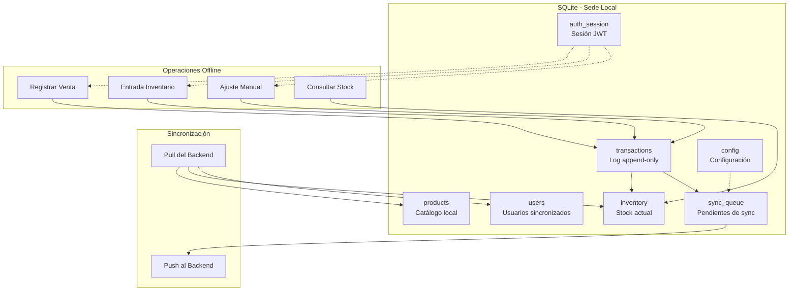
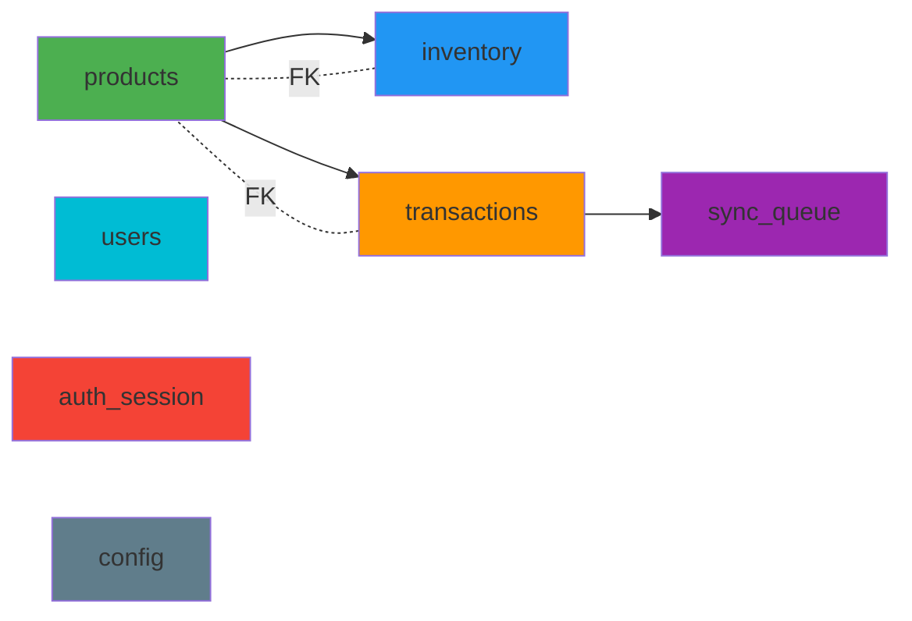

# Schema SQLite
## Base de Datos Local por Sede

**Proyecto:** Stocky  
**Versión:** 2.0 (Arquitectura Híbrida)  
**Última actualización:** 2026-02-09

---

## Introducción

Este documento describe el esquema completo de la base de datos local que cada sede mantiene en **SQLite** dentro de aplicaciones de escritorio (Tauri/Electron). Esta base de datos:

- Es la **fuente operativa** para operaciones locales de la sede
- Permite operación **100% offline** sin depender del backend
- Se sincroniza de forma **bidireccional** con el backend PostgreSQL
- **NO es un caché** - es una base de datos completa y funcional con persistencia garantizada

### Cambios respecto a la versión 1.0 (IndexedDB):

| Aspecto | v1 (IndexedDB + RxDB) | v2 (SQLite) |
|---------|----------------------|-------------|
| **Persistencia** | ⚠️ Volátil (navegador puede borrar) | ✅ Garantizada por el SO |
| **Límites** | ~50-100MB recomendado | Ilimitado (GB, TB) |
| **Queries** | Limitado (solo índices) | SQL completo (JOIN, GROUP BY) |
| **Transacciones** | Limitadas | ACID completas |
| **Concurrencia** | Single-writer | WAL mode (lecturas concurrentes) |
| **Backup** | Complejo | Simple (copiar archivo .db) |
| **Confiabilidad** | Depende del navegador | Extremadamente confiable |

### Diferencias clave con PostgreSQL (Backend)

| Aspecto | PostgreSQL (Backend Hub) | SQLite (Sede Local) |
|---------|--------------------------|---------------------|
| **Alcance** | Todos los tenants y sedes | Solo UNA sede |
| **Propósito** | Fuente de verdad global | Operación local rápida |
| **Datos** | Vistas consolidadas + coordinación | Datos operativos completos |
| **Campos extra** | `is_online`, `last_ping_at`, `sync_version` | `synced_at`, `sync_status` |
| **Tablas extra** | `activation_codes`, `sync_logs` | `sync_queue`, `auth_session` |

---

## Arquitectura de Datos Local



---

## Configuración de SQLite

```sql
-- Configuración recomendada para performance y confiabilidad
PRAGMA journal_mode = WAL;              -- Write-Ahead Logging para concurrencia
PRAGMA synchronous = NORMAL;            -- Balance entre performance y durabilidad
PRAGMA foreign_keys = ON;               -- Integridad referencial
PRAGMA auto_vacuum = INCREMENTAL;       -- Gestión automática de espacio
PRAGMA cache_size = -64000;             -- 64MB de caché
PRAGMA temp_store = MEMORY;             -- Tablas temporales en memoria
```

---

## Tablas SQLite

### Visión General



---

## 1. products (Catálogo Local)

**Descripción:** Catálogo completo de productos disponibles en esta sede. Se sincroniza bidireccionalmente con el backend.

```sql
CREATE TABLE products (
    id TEXT PRIMARY KEY,                    -- UUID del producto
    sku TEXT NOT NULL,                      -- Código único
    barcode TEXT,                           -- Código de barras (opcional)
    name TEXT NOT NULL,                     -- Nombre del producto
    description TEXT,                       -- Descripción
    category TEXT,                          -- Categoría
    price REAL NOT NULL CHECK(price >= 0),  -- Precio de venta
    cost REAL NOT NULL CHECK(cost >= 0),    -- Costo de adquisición
    unit TEXT NOT NULL,                     -- UNIT | KG | LITER | BOX
    sede_id TEXT NOT NULL,                  -- ID de esta sede
    tenant_id TEXT NOT NULL,                -- ID del tenant
    metadata TEXT,                          -- JSON con datos adicionales
    version INTEGER NOT NULL DEFAULT 1,     -- Control de versión
    last_modified_at INTEGER NOT NULL,      -- Timestamp de última modificación
    synced_at INTEGER,                      -- Timestamp de última sincronización
    sync_status TEXT DEFAULT 'PENDING',     -- PENDING | SYNCED | CONFLICT
    deleted INTEGER DEFAULT 0,              -- Soft delete flag (0 o 1)
    created_at INTEGER NOT NULL,
    updated_at INTEGER NOT NULL
);

CREATE INDEX idx_products_sku ON products(sku);
CREATE INDEX idx_products_category ON products(category);
CREATE INDEX idx_products_barcode ON products(barcode) WHERE barcode IS NOT NULL;
CREATE INDEX idx_products_sync_status ON products(sync_status);
CREATE INDEX idx_products_last_modified ON products(last_modified_at DESC);
```

### Campos Clave

- **`id`**: UUID generado localmente o recibido del backend
- **`sku`**: Código único del producto (ej: "LAP-HP-001")
- **`version`**: Incrementa con cada modificación, usado para resolver conflictos (Last-Write-Wins)
- **`last_modified_at`**: Timestamp del servidor (no del cliente) para sincronización
- **`synced_at`**: Última vez que se sincronizó con el backend
- **`sync_status`**: Estado de sincronización (PENDING, SYNCED, CONFLICT)
- **`deleted`**: Soft delete - nunca se elimina físicamente, solo se marca
- **`metadata`**: JSON flexible para imágenes, especificaciones, etc.

---

## 2. inventory (Stock Actual)

**Descripción:** Stock actual de cada producto en esta sede. Se calcula desde las transacciones.

```sql
CREATE TABLE inventory (
    id TEXT PRIMARY KEY,                        -- UUID del registro
    product_id TEXT NOT NULL,                   -- FK a products
    quantity REAL NOT NULL DEFAULT 0 CHECK(quantity >= 0),
    min_stock REAL NOT NULL DEFAULT 0,
    max_stock REAL NOT NULL DEFAULT 0,
    sede_id TEXT NOT NULL,
    version INTEGER NOT NULL DEFAULT 1,         -- Para detección de conflictos
    last_updated_at INTEGER NOT NULL,
    created_at INTEGER NOT NULL,
    updated_at INTEGER NOT NULL,
    FOREIGN KEY (product_id) REFERENCES products(id) ON DELETE CASCADE
);

CREATE UNIQUE INDEX idx_inventory_product ON inventory(product_id);
CREATE INDEX idx_inventory_updated ON inventory(last_updated_at DESC);
```

### Campos Clave

- **`product_id`**: Referencia al producto (foreign key)
- **`quantity`**: Stock actual calculado desde transacciones (no puede ser negativo)
- **`version`**: Para detectar conflictos durante sincronización
- **`min_stock` / `max_stock`**: Para alertas de reabastecimiento

---

## 3. transactions (Log Append-Only)

**Descripción:** Log inmutable de todas las transacciones de inventario. Nunca se modifica ni elimina.

```sql
CREATE TABLE transactions (
    id TEXT PRIMARY KEY,                    -- UUID generado en cliente
    type TEXT NOT NULL,                     -- SALE | PURCHASE | ADJUSTMENT | TRANSFER_IN | TRANSFER_OUT
    product_id TEXT NOT NULL,               -- FK a products
    quantity REAL NOT NULL,                 -- Cantidad (+ o -)
    price REAL,                             -- Precio unitario (para ventas)
    reason TEXT,                            -- Motivo de la transacción
    user_id TEXT NOT NULL,                  -- Usuario que registró
    sede_id TEXT NOT NULL,                  -- ID de esta sede
    transfer_id TEXT,                       -- ID de transferencia (nullable)
    metadata TEXT,                          -- JSON con datos adicionales
    client_timestamp INTEGER NOT NULL,      -- Cuándo ocurrió (tiempo local)
    server_timestamp INTEGER,               -- Cuándo llegó al backend (autoritativo)
    synced_at INTEGER,                      -- Cuándo se sincronizó
    sync_status TEXT DEFAULT 'PENDING',     -- PENDING | SYNCED | FAILED
    created_at INTEGER NOT NULL,
    FOREIGN KEY (product_id) REFERENCES products(id),
    CHECK (type IN ('SALE', 'PURCHASE', 'ADJUSTMENT', 'TRANSFER_IN', 'TRANSFER_OUT'))
);

CREATE INDEX idx_transactions_timestamp ON transactions(client_timestamp DESC);
CREATE INDEX idx_transactions_sync_status ON transactions(sync_status);
CREATE INDEX idx_transactions_product ON transactions(product_id);
CREATE INDEX idx_transactions_type ON transactions(type);
CREATE INDEX idx_transactions_synced ON transactions(synced_at);
```

### Campos Clave

- **`type`**: Tipo de movimiento
  - `SALE`: Venta (quantity negativa)
  - `PURCHASE`: Compra (quantity positiva)
  - `ADJUSTMENT`: Ajuste manual
  - `TRANSFER_IN`: Recepción desde otra sede
  - `TRANSFER_OUT`: Envío a otra sede
- **`client_timestamp`**: Cuándo ocurrió localmente (útil para offline)
- **`server_timestamp`**: Cuándo llegó al backend (autoritativo para ordenamiento)
- **`synced_at`**: NULL si aún no se sincronizó
- **`sync_status`**: Estado de sincronización

---

## 4. sync_queue (Cola de Sincronización)

**Descripción:** Cola de operaciones pendientes de sincronizar con el backend. Se procesa cuando hay conexión.

```sql
CREATE TABLE sync_queue (
    id TEXT PRIMARY KEY,                    -- UUID de la operación
    operation TEXT NOT NULL,                -- CREATE | UPDATE | DELETE
    entity_type TEXT NOT NULL,              -- products | inventory | transactions
    entity_id TEXT NOT NULL,                -- ID del documento afectado
    payload TEXT NOT NULL,                  -- JSON con datos a sincronizar
    timestamp INTEGER NOT NULL,             -- Cuándo se agregó a la cola
    retries INTEGER DEFAULT 0,              -- Intentos fallidos
    status TEXT DEFAULT 'PENDING',          -- PENDING | IN_PROGRESS | COMPLETED | FAILED
    error TEXT,                             -- Mensaje de error (nullable)
    created_at INTEGER NOT NULL,
    CHECK (operation IN ('CREATE', 'UPDATE', 'DELETE')),
    CHECK (entity_type IN ('products', 'inventory', 'transactions', 'users')),
    CHECK (status IN ('PENDING', 'IN_PROGRESS', 'COMPLETED', 'FAILED'))
);

CREATE INDEX idx_sync_queue_status ON sync_queue(status);
CREATE INDEX idx_sync_queue_timestamp ON sync_queue(timestamp ASC);
CREATE INDEX idx_sync_queue_entity ON sync_queue(entity_type, entity_id);
```

### Campos Clave

- **`operation`**: Qué hacer con el documento
- **`entity_type`**: En qué tabla está el documento
- **`payload`**: Los datos completos a sincronizar (JSON)
- **`retries`**: Contador de intentos fallidos (máximo 5)
- **`status`**: Estado de la sincronización

---

## 5. users (Usuarios Sincronizados)

**Descripción:** Usuarios sincronizados desde el backend para validación local de permisos.

```sql
CREATE TABLE users (
    id TEXT PRIMARY KEY,                    -- UUID del usuario
    email TEXT NOT NULL,                    -- Email
    name TEXT NOT NULL,                     -- Nombre completo
    role TEXT NOT NULL,                     -- TENANT_ADMIN | MANAGER | STAFF
    sede_id TEXT,                           -- Sede asignada (nullable para admins)
    tenant_id TEXT NOT NULL,                -- ID del tenant
    status TEXT NOT NULL DEFAULT 'ACTIVE',  -- ACTIVE | INACTIVE | LOCKED
    last_synced_at INTEGER,                 -- Última sincronización
    created_at INTEGER NOT NULL,
    updated_at INTEGER NOT NULL,
    CHECK (role IN ('SUPER_ADMIN', 'TENANT_ADMIN', 'MANAGER', 'STAFF')),
    CHECK (status IN ('ACTIVE', 'INACTIVE', 'LOCKED'))
);

CREATE INDEX idx_users_email ON users(email);
CREATE INDEX idx_users_role ON users(role);
```

**Nota:** No se almacenan contraseñas localmente. La autenticación siempre es contra el backend.

---

## 6. auth_session (Sesión de Autenticación)

**Descripción:** Almacena la sesión JWT del usuario para operación offline y validación local de permisos.

```sql
CREATE TABLE auth_session (
    id TEXT PRIMARY KEY,                    -- ID de la sesión
    token TEXT NOT NULL,                    -- JWT completo
    user_id TEXT NOT NULL,                  -- ID del usuario
    tenant_id TEXT NOT NULL,                -- ID del tenant
    sede_id TEXT NOT NULL,                  -- ID de la sede
    role TEXT NOT NULL,                     -- Rol del usuario
    expires_at INTEGER NOT NULL,            -- Timestamp de expiración
    last_refresh INTEGER,                   -- Última renovación
    created_at INTEGER NOT NULL,
    CHECK (role IN ('SUPER_ADMIN', 'TENANT_ADMIN', 'MANAGER', 'STAFF'))
);
```

### Campos Clave

- **`token`**: JWT completo para enviar en requests al backend
- **`expires_at`**: Para validar si el token sigue válido
- **`last_refresh`**: Última vez que se renovó el token

---

## 7. config (Configuración Local)

**Descripción:** Configuraciones y metadatos de la sede almacenados localmente.

```sql
CREATE TABLE config (
    id TEXT PRIMARY KEY,                    -- Clave de configuración
    key TEXT NOT NULL UNIQUE,               -- Nombre de la config
    value TEXT NOT NULL,                    -- Valor (JSON flexible)
    updated_at INTEGER NOT NULL
);

CREATE INDEX idx_config_key ON config(key);
```

### Configuraciones Típicas

```json
{
  "sede_id": "uuid-sede-123",
  "tenant_id": "uuid-tenant-456",
  "sede_name": "Tienda Norte",
  "last_pull_timestamp": 1707523200000,
  "sync_interval_ms": 300000,
  "offline_mode": false,
  "theme": "dark",
  "language": "es"
}
```

---

## Queries Importantes

### Calcular stock actual de un producto

```sql
SELECT 
    p.id,
    p.name,
    p.sku,
    COALESCE(i.quantity, 0) as current_stock,
    i.min_stock,
    CASE 
        WHEN COALESCE(i.quantity, 0) < i.min_stock THEN 'LOW_STOCK'
        WHEN COALESCE(i.quantity, 0) = 0 THEN 'OUT_OF_STOCK'
        ELSE 'OK'
    END as stock_status
FROM products p
LEFT JOIN inventory i ON p.id = i.product_id
WHERE p.deleted = 0
ORDER BY p.name;
```

### Recalcular inventario desde transacciones

```sql
-- Útil para verificar consistencia
SELECT 
    product_id,
    SUM(quantity) as calculated_quantity
FROM transactions
WHERE sede_id = :sedeId
GROUP BY product_id;
```

### Obtener transacciones pendientes de sincronizar

```sql
SELECT *
FROM transactions
WHERE sync_status = 'PENDING'
ORDER BY client_timestamp ASC
LIMIT 50;
```

### Obtener operaciones en sync_queue

```sql
SELECT *
FROM sync_queue
WHERE status = 'PENDING'
  AND retries < 5
ORDER BY timestamp ASC
LIMIT 50;
```

### Productos con stock bajo

```sql
SELECT 
    p.name,
    p.sku,
    i.quantity,
    i.min_stock,
    (i.min_stock - i.quantity) as deficit
FROM products p
JOIN inventory i ON p.id = i.product_id
WHERE i.quantity < i.min_stock
  AND p.deleted = 0
ORDER BY deficit DESC;
```

---

## Triggers para Integridad

### Actualizar inventory al crear transacción

```sql
CREATE TRIGGER update_inventory_after_transaction
AFTER INSERT ON transactions
FOR EACH ROW
BEGIN
    UPDATE inventory
    SET quantity = quantity + NEW.quantity,
        last_updated_at = NEW.client_timestamp,
        updated_at = NEW.client_timestamp
    WHERE product_id = NEW.product_id;
END;
```

### Agregar a sync_queue al modificar producto

```sql
CREATE TRIGGER sync_product_on_update
AFTER UPDATE ON products
FOR EACH ROW
WHEN NEW.sync_status = 'PENDING'
BEGIN
    INSERT INTO sync_queue (id, operation, entity_type, entity_id, payload, timestamp, created_at)
    VALUES (
        hex(randomblob(16)),
        'UPDATE',
        'products',
        NEW.id,
        json_object(
            'id', NEW.id,
            'sku', NEW.sku,
            'name', NEW.name,
            'price', NEW.price,
            'version', NEW.version
        ),
        strftime('%s', 'now') * 1000,
        strftime('%s', 'now') * 1000
    );
END;
```

---

## Migración de Datos

### Script de inicialización

```sql
-- Crear todas las tablas
-- (Schemas completos arriba)

-- Insertar configuración inicial
INSERT INTO config (id, key, value, updated_at) VALUES
    ('sede_id', 'sede_id', '"uuid-to-be-set"', strftime('%s', 'now') * 1000),
    ('tenant_id', 'tenant_id', '"uuid-to-be-set"', strftime('%s', 'now') * 1000),
    ('last_pull_timestamp', 'last_pull_timestamp', '0', strftime('%s', 'now') * 1000);
```

---

## Backup y Restauración

### Backup

```bash
# Copiar archivo SQLite
cp stocky.db stocky_backup_$(date +%Y%m%d_%H%M%S).db

# O usar comando SQLite
sqlite3 stocky.db ".backup stocky_backup.db"
```

### Restauración

```bash
# Restaurar desde backup
cp stocky_backup.db stocky.db

# O usar comando SQLite
sqlite3 stocky.db ".restore stocky_backup.db"
```

---

## Mantenimiento

### Limpiar transacciones antiguas (opcional)

```sql
-- Archivar transacciones de más de 1 año
DELETE FROM transactions
WHERE client_timestamp < strftime('%s', 'now', '-1 year') * 1000
  AND sync_status = 'SYNCED';
```

### Vacuum periódico

```sql
-- Recuperar espacio después de eliminar datos
PRAGMA incremental_vacuum;

-- O full vacuum (bloquea la base de datos)
VACUUM;
```

### Verificar integridad

```sql
PRAGMA integrity_check;
PRAGMA foreign_key_check;
```

---

## Glosario

- **Append-Only**: Solo agregar, nunca modificar ni eliminar
- **ACID**: Atomicity, Consistency, Isolation, Durability
- **FK**: Foreign Key (clave foránea)
- **JWT**: JSON Web Token
- **PK**: Primary Key (clave primaria)
- **Soft Delete**: Marcar como eliminado sin borrar físicamente
- **WAL**: Write-Ahead Logging - modo de journal de SQLite
